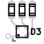
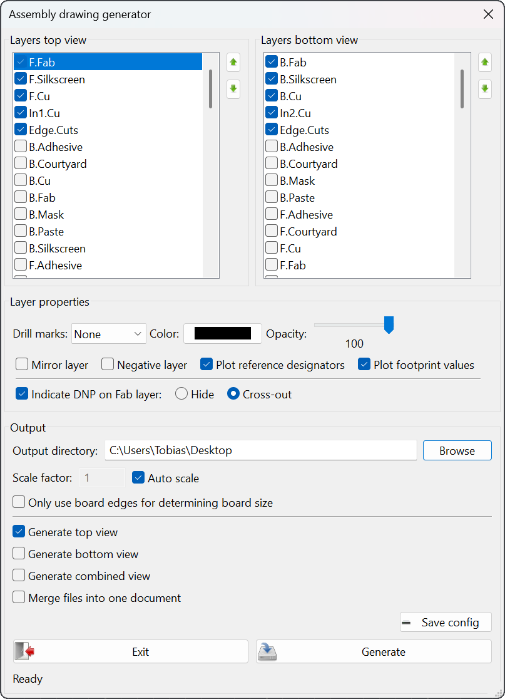
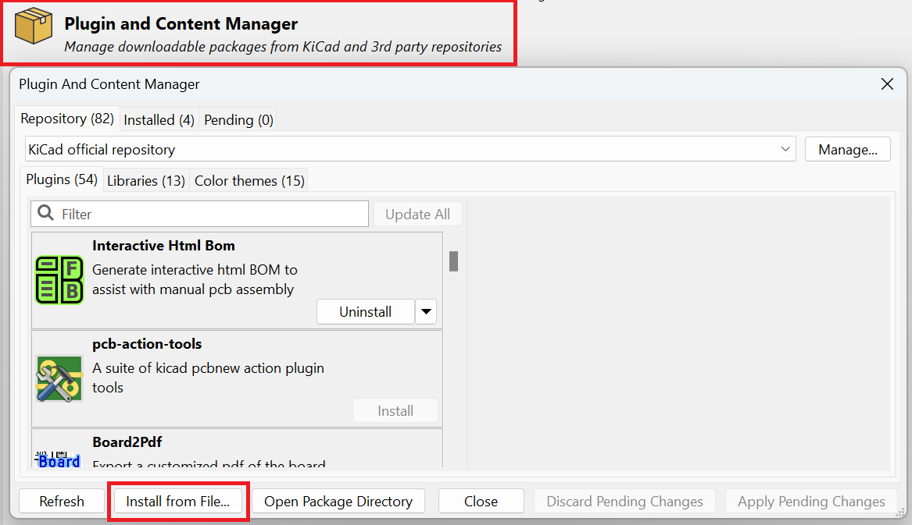
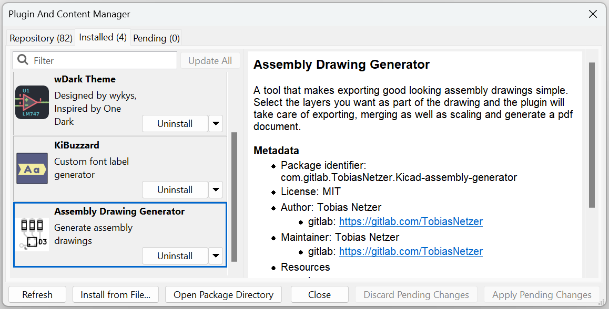

# Kicad Assembly Drawing Generator

A tool that makes it easy to export good-looking assembly drawings from a `.kicad_pcb` file. This addon takes care of exporting selected layers from kicad as SVG-files, coloring, merging and scaling, then generates an easy to share pdf document.

Examples:
- NanoLogger: [Top View](doc/nanoLogger%20-%20Assembly%20Drawing%20Top.pdf)
- NanoLogger (with additional colored layers): [Top View](doc/nanoLogger%20-%20Assembly%20Drawing%20Top%20Color.pdf)
- PrecisionCurrentSource: [Combined View](doc/PrecisionCurrentSource%20-%20Assembly%20Drawing%20Top%20+%20Bot.pdf)
- [Tigard](https://github.com/tigard-tools/tigard): [Top + Bot View](doc/tigard%20-%20Assembly%20Drawing.pdf)

## Usage

Configure `Top` and `Bottom` views of your board:
- Simply select and sort the layers you want shown in your assembly drawing
- Adjust the layer properties for each layer to achieve the look you want

Configure the `Output`:
- Select a scale factor or use the auto scaling option
- Select board views to export
- An `Assembly Drawing` folder containing the exported files will be created in the output directory, which by default points to the project folder

Make sure to save your configuration once you're happy with it!

## Installation

**Note:** [CairoSVG](https://github.com/Kozea/CairoSVG) needs to be installed in order for the plugin to convert svg files into pdf's.
- To install it simply open `KiCad Command Prompt` and run `python -m pip install cairosvg`

Kicad assembly drawing generator is currently not part of the official Kicad addons repository and therefore has to be manually installed.
- Download the current release
- Open the Kicad PCM and select `Install from File...`
- Select the downloaded `.zip` archive containing the plugin
- The plugin should now show up in the installed tab

## Disclaimer

This plugin was created for my specific needs and probably won't cover all edge cases.

## Licence and credit

Plugin code licensed under MIT, see `LICENSE` for more info.
- Python PDF library: [PyPDF](https://github.com/py-pdf/pypdf)
- SVG to PDF converter: [CairoSVG](https://github.com/Kozea/CairoSVG)
